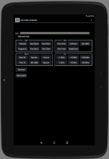

ArduVidRx Controller
--------------------

The ArduVidRx Controller is an Android app for controlling an [ArduVidRx
receiver](http://www.etheli.com/ArduVidRx) (an FPV video receiver that
has been modified to have an Arduino board).  Communication is via
Bluetooth.  The project is developed and built using Android Studio.

See [here for instructions](https://github.com/ethomas997/ArduVidRxController/blob/master/app/doc/Instructions.md).

This project makes use of code from the
[BlueTerm](https://github.com/johnhowe/BlueTerm), [ApmeM FlowLayout](https://github.com/ApmeM/android-flowlayout)
and [android-tone-player](https://github.com/m-abboud/android-tone-player) projects.
  
  
* * * * *

Click [here to contact me](http://www.etheli.com/contact/index.html)

[etheli.com home page](http://www.etheli.com)